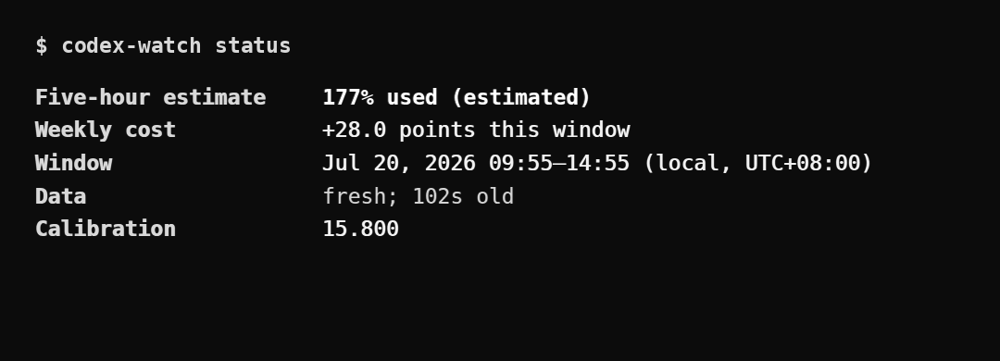
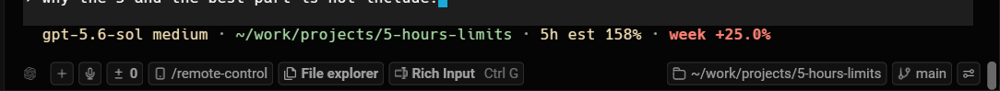
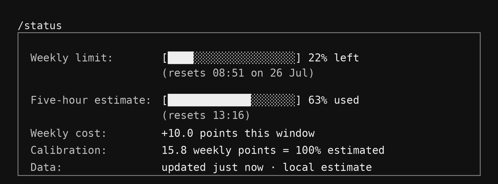
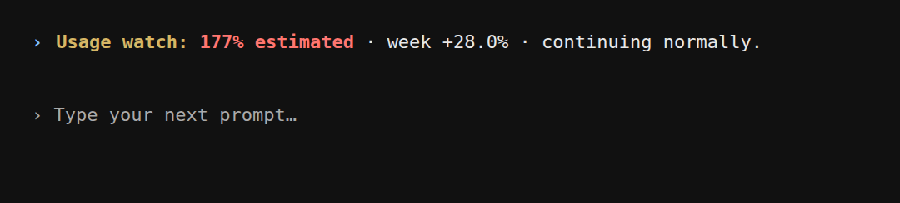

# Codex Usage Watch

A small personal project that estimates how much of the old five-hour Codex
allowance you have used. It reads the weekly percentage already recorded by
Codex and turns the change into a local estimate:

```text
5h est 158% · week +25.0%
```

- `5h est 158%` means about 1.58 times the old five-hour allowance.
- `week +25.0%` means weekly usage increased by 25 percentage points during
  this five-hour window.
- The estimate can go above 100%. Nothing is blocked.

This is only a local estimate, not official OpenAI usage or billing data.

## Four ways to see the output

### 1. Terminal

```bash
codex-watch status
```



Other useful commands:

```bash
codex-watch refresh     # look for newer usage data
codex-watch history     # show recent five-hour windows
codex-watch analyze     # show how the estimate was calculated
codex-watch doctor      # check the local setup
```

### 2. Codex status line

```text
5h est 158% · week +25.0%
```



The normal Codex CLI cannot add this project to `/statusline`. The screenshot
uses a small custom Codex build with the `local-five-hour-limit` item. This part
is optional and is not installed by the setup below.

### 3. Codex `/status`



The same custom build adds **Five-hour estimate** and **Weekly cost** to
`/status`. The normal Codex CLI does not show these rows, so use
`codex-watch status` for the same details.

### 4. Hook messages inside Codex



The hooks show the current estimate when Codex starts and a short message when
you cross a warning level. The `Stop` hook saves the newest observation
silently. If a hook fails, Codex continues normally.

`/hooks` is only where you review and trust the hooks; it is not another status
screen.

## Install

The project is developed and tested on Ubuntu 25.10. Other Linux versions may
work, but I have not tested them. You need Rust 1.85 or newer and Codex CLI.

Clone the project and run:

```bash
git clone https://github.com/snikmas/codex-usage-watch.git
cd codex-usage-watch
make test
make lint
PREFIX="$HOME/.local" INSTALL_HOOKS=1 scripts/install.sh
```

The installer builds `codex-watch`, puts it in `~/.local/bin`, and adds three
Codex hooks. It does not replace your normal Codex installation and does not
need `sudo`.

Start tracking from now:

```bash
"$HOME/.local/bin/codex-watch" setup --skip-import
"$HOME/.local/bin/codex-watch" status
```

Then restart Codex, open `/hooks`, review and trust `SessionStart`,
`UserPromptSubmit`, and `Stop`, and start a new Codex session. You can check the
setup with:

```bash
"$HOME/.local/bin/codex-watch" doctor
```

If `codex-watch` is not found in a new terminal, either use the full path above
or add `~/.local/bin` to your `PATH`.

## Optional history import

By default, `setup --skip-import` starts from now and does not read old
sessions. To preview the older session files it can use:

```bash
codex-watch setup --preview
```

To import their usage metadata:

```bash
codex-watch setup --import --confirm
```

The tracker keeps usage metadata, not prompts, responses, tool arguments, or
source code.

## How the estimate works

Codex records how the weekly usage percentage changes. Codex Usage Watch adds
the positive changes seen during a local five-hour window and converts them
using its calibration value.

- `fresh` means recent usage data was found.
- `stale` means the newest data is old.
- `unknown` means there is not enough compatible data yet; it does not mean 0%.

The value is useful as a rough pressure gauge, not as an exact account limit.

## Privacy

Everything stays on your computer. The tracker reads structured rate-limit
metadata and timestamps from local Codex session files. It does not store your
prompts, responses, reasoning, tool arguments, command output, or source code.

State is stored under your local data directory in `codex-usage-watch`. You can
choose another location with `CODEX_USAGE_WATCH_HOME`.

## Remove it

Remove only the hooks and keep the command and saved data:

```bash
codex-watch uninstall --confirm
```

Remove the hooks and installed command while keeping the saved database:

```bash
PREFIX="$HOME/.local" scripts/uninstall.sh --confirm
```

Run the second command from the cloned project directory.

## Limitations

- The estimate depends on Codex's local session format and may become inaccurate
  if that format changes.
- macOS and Windows installation have not been tested.
- The `/statusline` and `/status` additions require the separate custom Codex
  build; the normal installation only provides the terminal command and hooks.
- The local database does not have automatic cleanup yet.

## Contributing

This is a personal project, but small issues and pull requests are welcome. Run
`make test` and `make lint` before submitting a change, and use synthetic test
data instead of real Codex transcripts.

MIT licensed.
